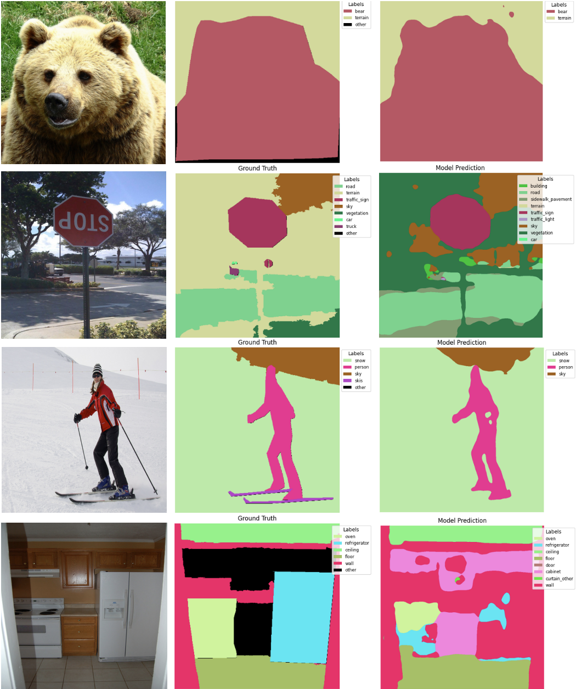

# Overview

It's an reimplementation of **Language-driven Semantic Segmentation** (LSeg) model from https://arxiv.org/abs/2201.03546.
It's a multimodal model for image semantic segmentation.  As a brief summary, LSeg combines a CLIP pretrained text encoder (ViT-B/32 architecture) and a Dense Prediction Transformer pixel-wise image encoder (DPT), project them onto the same multimodal embedding space, and use contrastive learning for training. 

# Requirements

This will install mseg module (only works in Linux or MacOS), our requirements, and the CLIP encoders.

```
pip install -e mseg
pip install -r requirements.txt
pip install git+https://github.com/openai/CLIP.git
```

# Usage

To train on cluster: This runs the python script `train.py`.

```
sbatch train_script_on_hpc.sh
```

To evaluate the trained model: `demo.ipynb` and `eval.ipynb`

To download our datasets and pretrained model: https://huggingface.co/datasets/richardz03/MSeg_COCO_ADE20K \
Place the model within checkpoints/ folder.

## Data

We used MSeg. \
The semantic labels outputs corresponds to the `universal` column in `mseg-api/mseg/class_remapping_files/MSeg_master.tsv`

The datasets such as `COCOPanoptic` and `ADE20K` must lie within the folder `data/mseg_dataset/`:

- `COCOPanoptic/` should contain `images/` and `semantic_relabeled133/` subfolders
- `ADE20K/` should contain `images/` and `annotations_semseg150_relabeled/` subfolders.
  These datasets are downloaded from MSeg repository (`mseg_api`) with remapping applied as they describe.

## Results

Training with COCOPanoptic and ADE20K, after 1 epoch with training accuracy = 0.67 and validation accuracy 0.68: The learning procedure needs to be further investigated (either bug or requires additional techniques for finetuning), as the model doesn't improve beyond this.



## DPT notes

### What is ViTWrapper

To make ViT work with arbitrary image size as input, made these changes during inference for each input image x:

1. Change attribute `image_size` (assumes H = W = `image_size`) of the ViT model. This is necessary to bypass the assert check `self.image_size == h == w` in `VisionTransformer._process_input(x)`.
2. Interpolate the learned position embedding by using their helper function `interpolate_embeddings` in `torchvision/models/vision_transformer.py`
   Link: https://github.com/pytorch/vision/blob/main/torchvision/models/vision_transformer.py#L268

### How to use DPT for LSeg

To use DPT as an pixel-wise encoder. Initialize it with this, where `C` is the desired multimodal embedding dimension. \
`model = DPT(head=nn.Identity(), output_feature_dim=C)`
